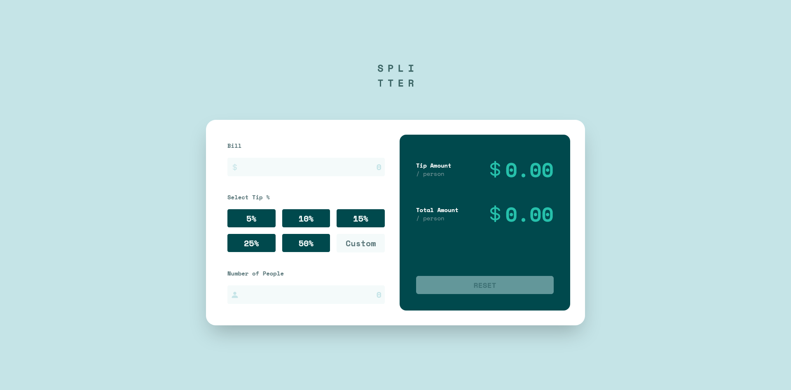
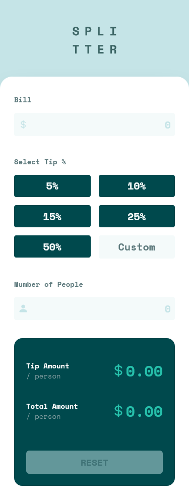

# Frontend Mentor - Tip calculator app solution

This is a solution to the
[Tip calculator app challenge on Frontend Mentor](https://www.frontendmentor.io/challenges/tip-calculator-app-ugJNGbJUX).
Frontend Mentor challenges help you improve your coding skills by building
realistic projects.

## Table of contents

-   [Overview](#overview)
    -   [The challenge](#the-challenge)
    -   [Screenshot](#screenshot)
    -   [Links](#links)
-   [My process](#my-process)
    -   [Built with](#built-with)
-   [Author](#author)

## Overview

### The challenge

Users should be able to:

-   View the optimal layout for the app depending on their device's screen size
-   See hover states for all interactive elements on the page
-   Calculate the correct tip and total cost of the bill per person

### Screenshot

### Links

-   [Live](https://shivi-tip-calculator.netlify.app/)

## My process

### Built with

-   HTML5
-   CSS3
-   [React](https://reactjs.org/)
-   [TypeScript](https://www.typescriptlang.org/)
-   [Tailwind CSS](https://tailwindcss.com/)
-   [ZOD](https://zod.dev/)
-   [React Hook Form](https://react-hook-form.com/api/)
-   [React Icons](https://react-icons.github.io/react-icons/)

## Author

-   [Shivangam Soni](https://shivangam-soni.vercel.app/)
-   Frontend Mentor -
    [@ShivangamSoni](https://www.frontendmentor.io/profile/ShivangamSoni)
-   GitHub - [@ShivangamSoni](https://github.com/ShivangamSoni)
